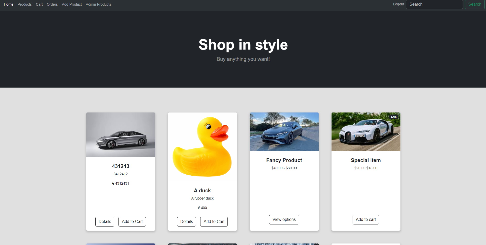

# Project Title

FullStack eCommerce application Node.js. 

## Project Overview

- User Authentication: Provides secure registration, login, and logout functionalities for users.
- Product Management: Allows admins to create, update, and delete products.
- Shopping Cart: Enables users to add products to their cart and proceed to checkout.
- Order Management: Allows users to view their order history and track the status of their orders.
- Payment Processing: Integrates with payment gateways for secure transaction processing.

## Tech Stack
- Node.js: A JavaScript runtime environment for building scalable network applications.
- Express.js: A minimalist web application framework for Node.js, providing a robust set of features.
- MongoDB: A NoSQL database for storing product and user data.
- Mongoose: An elegant MongoDB object modeling tool for Node.js.
- HTML, CSS (Bootstrap), JavaScript: Front-end technologies for building responsive and interactive user interfaces.

## Other Features:
- Sending emails for order confirmation and updates.
- Data pagination for improved user experience.
- Handling file uploads for product images.
- Input validation to ensure data integrity and security.

## Getting Started
- To run this project locally, follow these steps:

    + Clone the repository.
    + Install dependencies using npm install.
    + Set up your MongoDB database and configure the connection in the project.
    + Configure any necessary environment variables.
    + Run the application using npm start.

## What could have been improved
- Using a Better Frontend Framework like React.
- Adopting an SPA (Single Page Application) Approach and Using REST API: Decoupling the frontend and backend by adopting a RESTful API architecture would make the application more scalable and flexible, allowing for easier integration with other services and platforms.
- Storing files on the cloud, for example AWS S3
 

## Authors

- [@DumpyBird](https://github.com/jameshnl232)

## License

[MIT](https://choosealicense.com/licenses/mit/)

## Demo

